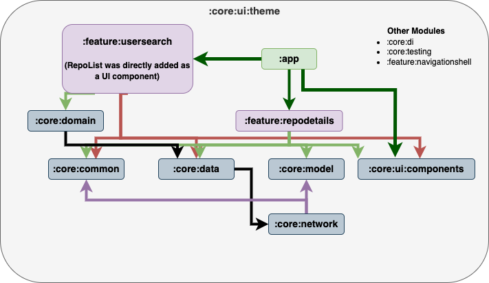
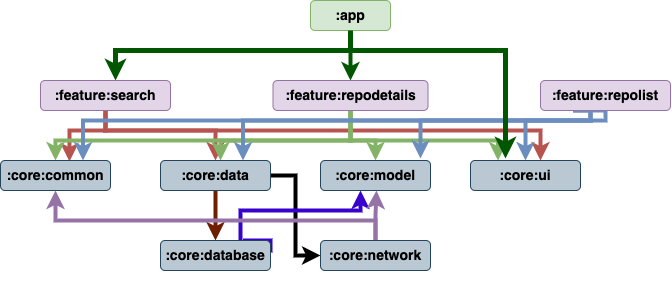

# MyRepoApp

MyRepoApp is an Android application built to showcase best practices in Android development, including modern architecture, Jetpack Compose, Hilt for dependency injection, and robust testing strategies. The app allows users to search for GitHub profiles and view their public repositories.

[MyRepoApp Overview Video](./AppOverview.mp4)

## Table of Contents

- [MyRepoApp](#myrepoapp)
   - [Table of Contents](#table-of-contents)
   - [Motivation](#motivation)
      - [Workflow Setup and Project Management](#workflow-setup-and-project-management)
      - [Architectural Design](#architectural-design)
   - [Architecture Overview](#architecture-overview)
      - [Revised Architecture](#revised-architecture)
      - [Key Modules and Their Responsibilities](#key-modules-and-their-responsibilities)
   - [Development Process](#development-process)
      - [Initial Project Setup](#initial-project-setup)
      - [Build Logic](#build-logic)
      - [Feature Development](#feature-development)
      - [Testing](#testing)
      - [Revisions and Final Architecture](#revisions-and-final-architecture)
   - [Conclusion](#conclusion)

## Motivation

### Workflow Setup and Project Management

When approaching any project, I like to ensure that the workflow is well-organized, quality is maintained, and processes are automated wherever possible. For this project, I set up a GitHub Project board to track tasks, manage progress, and ensure transparency throughout the development cycle. This allowed me to stay focused on priorities while keeping an eye on overall progress.

I integrated CI/CD pipelines using GitHub Actions to automate builds and tests, ensuring that every change is verified before being merged. This not only speeds up development but also minimizes the chances of introducing bugs into the main codebase.

To maintain a clean and consistent codebase, I incorporated tools like Spotless and Ktlint. These tools automatically format the code and enforce coding standards, making sure that the code remains readable and maintainable over time.

Branch protection rules were also set up to enforce that all CI checks pass before a PR can be merged. This helps maintain the integrity of the codebase by ensuring that every contribution meets the project’s quality standards.

### Architectural Design

The architecture of MyRepoApp was designed with scalability and maintainability in mind. The modular approach allows each feature and core component to evolve independently, making the app adaptable to future changes and expansions. By separating concerns and utilizing clean architecture principles, I aimed to create a robust foundation that could support the app's growth without becoming unwieldy or difficult to manage.

The motivation behind this structure and workflow is not just to showcase overengineering, but to demonstrate how a thoughtful setup can lead to long-term project health. By applying these principles, I wanted to pack in my knowledge of what’s required to keep a project top-notch for the long term, balancing both technical rigor and practical application.

Through this process, I’ve highlighted the importance of maintaining quality, staying organized, and leveraging automation to streamline development – all key elements in delivering a successful project.

## Architecture Overview

The architecture of MyRepoApp is designed to be modular, scalable, and maintainable, with a clear separation of concerns. Initially, the architecture was structured to accommodate these goals, and as the project progressed, several refinements were made to enhance the overall structure and performance.

### Revised Architecture

Throughout development, the architecture was revised to improve the flow of data and reduce unnecessary dependencies. Below is the updated architecture diagram:

#### Final Architecture

##### Initial Architecture

#### Key Modules and Their Responsibilities

- **:core:** Houses the core logic and models shared across the application.
   - **:core:data:** Handles data repositories and mapping between domain and network layers.
   - **:core:network:** Manages all network interactions and API calls.
   - **:core:ui:** Provides shared UI components, theming, and design elements.
- **:feature:usersearch:** Manages the user search functionality and displays the list of repositories. The `RepoList` component was directly integrated here to simplify UI management.
- **:feature:repodetails:** Displays detailed information for selected repositories, including dynamic data updates based on user interactions.
- **:app:** Acts as the main entry point for the app, managing overall navigation and integration of different features.
- **Other Modules:**
   - **:core:di:** Configures and provides dependencies across the app.
   - **:core:testing:** Contains shared testing utilities and configurations.
   - **:feature:navigationshell:** Handles the back navigation setup and a shell scaffold component to uniformly handle navigation on each screen feature.

## Development Process

### Initial Project Setup

- **Objective:** Establish a modular architecture to ensure scalability and maintainability.
- **Thought Process:** Starting with a clear separation of concerns allowed for independent development and testing of features, which facilitated smoother integration and higher code quality.

### Build Logic

- **Objective:** Implement custom build logic for consistent dependency management.
- **Thought Process:** By centralizing build configurations in a dedicated module, we reduced redundancy and improved maintainability. For detailed build logic, refer to the [Build Logic README](./build-logic/README.md).

### Feature Development

- **User Search and Repo Listing:**
   - **Objective:** Enable users to search for GitHub profiles and view their repositories.
   - **Thought Process:** Directly integrating the `RepoList` component into the search feature streamlined the user interface and reduced unnecessary complexity, while still maintaining a clear separation of concerns.

- **Repo Details:**
   - **Objective:** Provide detailed views for repositories with additional metadata.
   - **Thought Process:** Keeping the details view as a separate feature module allowed flexibility in data presentation and ensured that the architecture remained modular and easy to maintain.

### Testing

- **Unit Tests:**
   - **Objective:** Validate core logic and feature-specific behavior.
   - **Thought Process:** Comprehensive unit tests were implemented across all features to ensure robustness and reliability, covering a wide range of scenarios.

- **UI Testing:**
   - **Objective:** Ensure the user interface behaves correctly with simulated network responses.
   - **Thought Process:** Utilizing `MockWebServer`, we were able to simulate API responses and test the UI in a controlled environment, ensuring that the app responds correctly to various data inputs.

### Revisions and Final Architecture

- **Refinement:**
   - **Objective:** Enhance architecture for improved scalability and maintainability.
   - **Thought Process:** Revisions were guided by the need to reduce coupling between modules and improve data flow. The separation of concerns was emphasized, particularly in how the `RepoDetails` feature was handled, resulting in a more maintainable and scalable codebase.

## Conclusion

MyRepoApp demonstrates a commitment to modern Android development practices, with an emphasis on clean architecture, modularization, and comprehensive testing. The iterative development process allowed for continuous refinement, resulting in an application that is well-structured, scalable, and prepared for future enhancements.

By following this structured approach, MyRepoApp serves as a strong foundation for both current functionality and potential future expansions, showcasing a mature and thoughtful engineering process.

